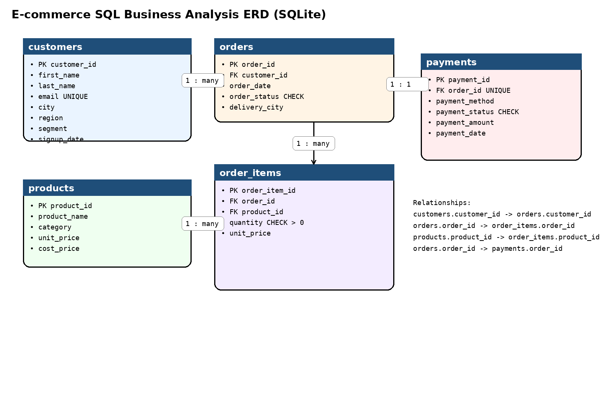
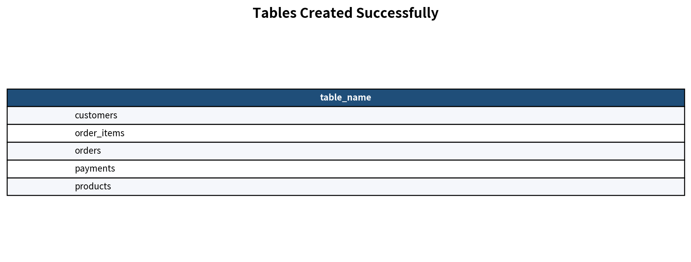
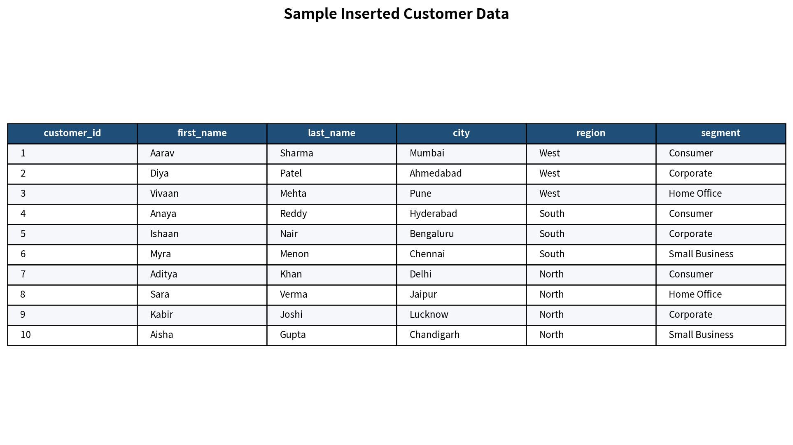
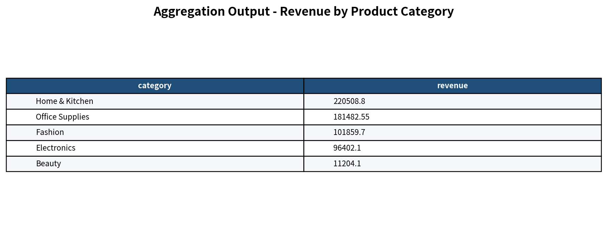
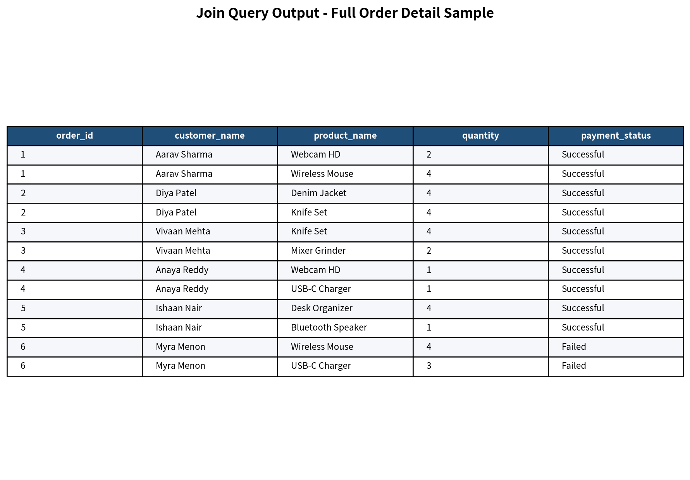
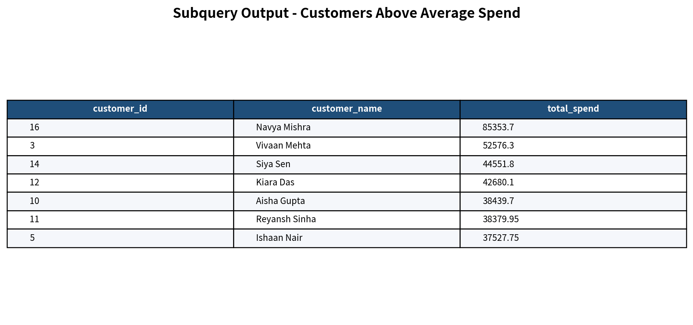
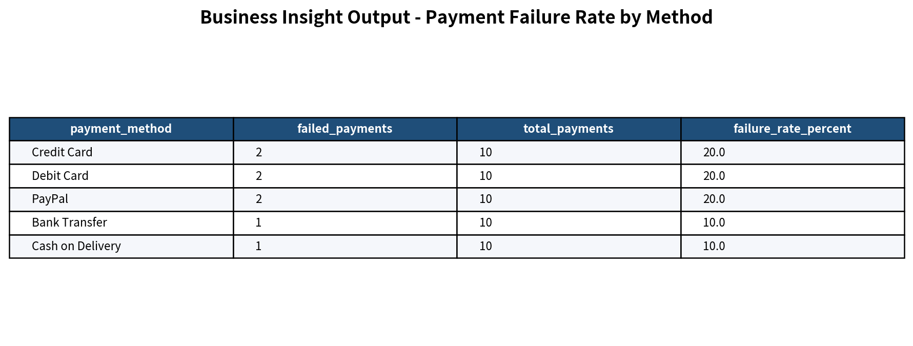

# Capstone Project Part 4 - SQL Business Analysis
## Student Details
- **Student Name:** Abhilash Pandey
- **Student ID:** rotman_ddm_2602008 
- **Assignment Title:** Part 4 - SQL Business Analysis Capstone
- **Database System Used:** SQLite

## Database Overview
This project designs a normalized relational database for an e-commerce business. It stores customer details, product catalog data, orders, order line items, and payment records. The dataset was custom-created to satisfy the assignment rules, including multiple cities, regions, customer segments, product categories, cancelled and returned orders, failed payments, customers without orders, orders with multiple products, and products that were never ordered.

## Table Descriptions
### 1. `customers`
Stores customer profile and market segmentation details.
- `customer_id` - unique customer key
- `first_name`, `last_name` - customer name
- `email` - unique email address
- `city`, `region` - geographic attributes
- `segment` - business segment (`Consumer`, `Corporate`, `Home Office`, `Small Business`)
- `signup_date` - date customer registered

### 2. `products`
Stores product catalog information.
- `product_id` - unique product key
- `product_name` - item name
- `category` - product category
- `unit_price` - selling price
- `cost_price` - internal cost

### 3. `orders`
Stores each order header.
- `order_id` - unique order key
- `customer_id` - linked customer
- `order_date` - date order was placed
- `order_status` - `Completed`, `Cancelled`, or `Returned`
- `delivery_city` - delivery destination city

### 4. `order_items`
Stores line-level order details.
- `order_item_id` - unique order line key
- `order_id` - linked order
- `product_id` - linked product
- `quantity` - units purchased
- `unit_price` - selling price captured at order time

### 5. `payments`
Stores payment activity for each order.
- `payment_id` - unique payment key
- `order_id` - linked order
- `payment_method` - method used to pay
- `payment_status` - `Successful` or `Failed`
- `payment_amount` - amount paid
- `payment_date` - payment date

## Relationship Explanation
- One **customer** can place many **orders**.
- One **order** can contain many **order_items**.
- One **product** can appear in many **order_items**.
- One **order** has one related **payment** in this project dataset.

## ERD Image


## How to Run the Schema and Insert Files
### Option 1: SQLite command line
```bash
sqlite3 ecommerce_analysis.db < schema/create_tables.sql
sqlite3 ecommerce_analysis.db < data/insert_data.sql
```

### Option 2: SQLite GUI / DB Browser for SQLite
1. Open or create a SQLite database file.
2. Run `schema/create_tables.sql`.
3. Run `data/insert_data.sql`.
4. Execute the SQL files inside `queries/` one by one.

## Description of Each Query File
- `queries/01_basic_select.sql` - simple select statements, sorting, aliases, and distinct values
- `queries/02_filtering_and_case.sql` - filtering conditions, date ranges, string matching, and CASE logic
- `queries/03_aggregations.sql` - counts, sums, averages, grouped revenue, profit, and HAVING examples
- `queries/04_joins.sql` - multi-table joins for operational and customer revenue analysis
- `queries/05_subqueries.sql` - subqueries for above-average, exists/not exists, and multi-category analysis
- `queries/06_business_insights.sql` - direct business questions with explanatory SQL comments and actionable insights

## Screenshots of Query Outputs
Screenshots are available in `outputs/screenshots/`:







## At Least 5 Business Insights Based on SQL Output
- 1. Prioritize the Corporate segment because it generates the highest revenue (191684.85).
- 2. Expand Home & Kitchen inventory because it has the highest gross profit (68388.8).
- 3. Review Credit Card checkout flow because it has the highest payment failure rate (20.0%).
- 4. Launch reactivation campaigns for 3 customers who signed up but never placed an order.
- 5. Reassess or promote 3 products that were never ordered to reduce dead stock.


## Additional Insight Notes
- The dataset shows clear revenue concentration in one or two customer segments, which suggests targeted marketing can improve ROI.
- Some payment methods perform worse than others, so checkout and fraud rules should be reviewed by payment channel.
- The presence of customers with no orders indicates an opportunity for onboarding and reactivation campaigns.
- Products never ordered should be discounted, bundled, or replaced.
- Comparing revenue and gross profit helps avoid promoting high-sales but low-margin products.

## Assumptions Made
1. SQLite is used as the single database system for the whole project.
2. Each order has one related payment record to simplify payment analysis.
3. Failed payments are recorded with `payment_amount = 0`.
4. `delivery_city` is stored on the order to allow city-based fulfillment analysis.
5. The recency rule in business insight query 6 defines “not recent” as last order date before `2024-05-15`.
6. Order item `unit_price` can differ slightly from product master `unit_price` to simulate discounts and pricing variation.

## Submission Checklist
- Rename the root folder and GitHub repository to your actual required format.
- Replace the student name and student ID in this README.
- Push the full folder contents to a **public GitHub repository**.
- Submit the **repository link only** on your platform.
- Do **not** upload a ZIP file to the assignment portal.
